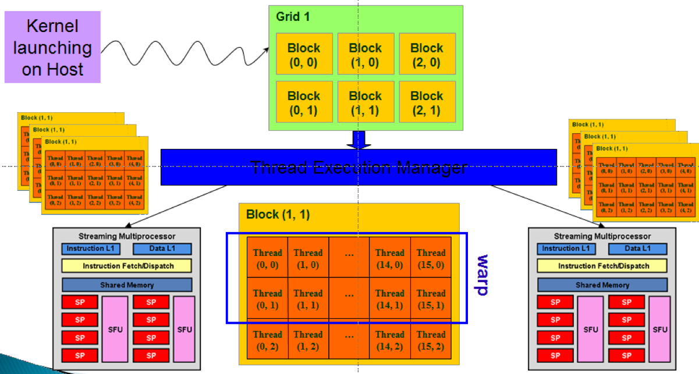

Winter Labs for PKUSC
========================================================================

"面向新同学的任务"取材和改编自超算队在2020、2021举行的几次培训，主要向大家介绍并行编程的几种基本工具和操作。旨在让各位同学对超算相关的知识和技术有一定的了解掌握，以便在之后解决具体问题的时候不必花费过多时间从头学起，只需要查阅相应的技术细节即可上手。

本次的任务为"MPI编程，OpenMP编程，CUDA编程"
请同学们浏览讲义内容，查阅相关资料，完成讲义内布置的「二加x道作业题目」

小贴士：
- 程序编写和测试环境请使用超算队集群，帐号注册和登录方式请参见 PKUSC Useful Links 文档中的相关项目。如遇任何问题请及时与本人联系。 
Email:
haozhewen@pku.edu.cn

---------

.. toctree::
   :maxdepth: 2
   :caption: Contents:

   lab1.rst
   lab2.rst
   lab3.rst
